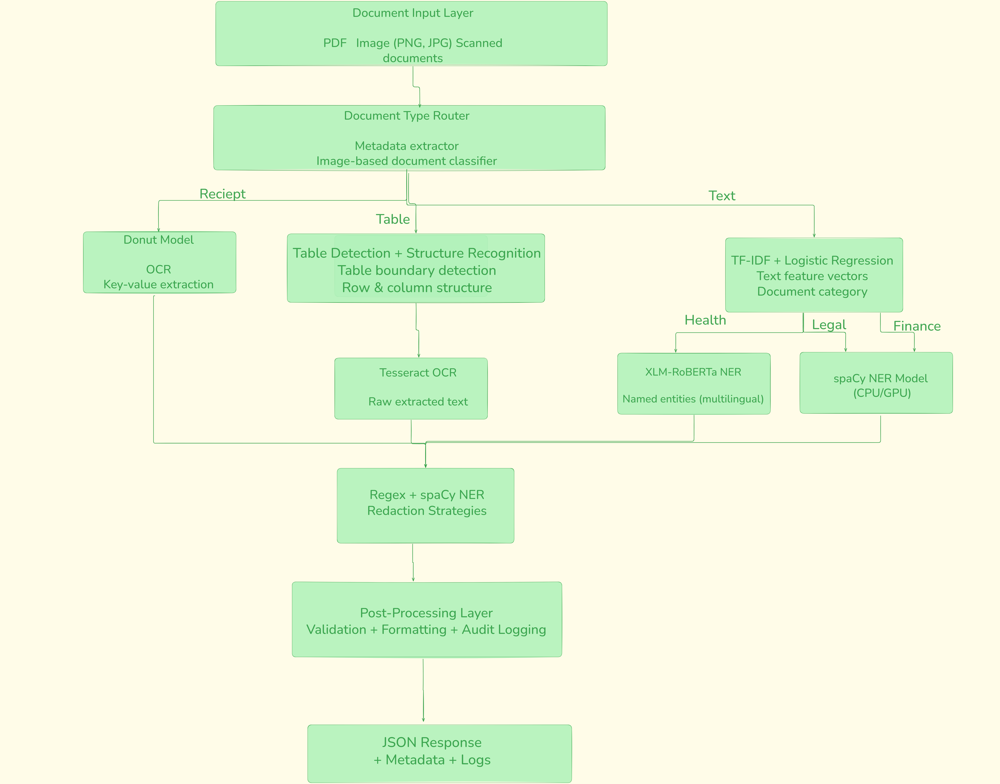

# Motivations

## 1. Why do you want to work with NeuroKnow AI within Inria?

NeuroKnow AI's focus on document intelligence matches my experience perfectly. At Subsea 7 and MaqsoodLabs, I built systems that parse complex documents, extract structured data from PDFs, and handle diverse layouts using OCR and transformer models. NeuroKnow AI is solving these same problems but across healthcare, legal, and finance domains at scale.

I love the startup environment. At MaqsoodLabs, I saw how fast you can move from idea to production. Startups let you build end-to-end systems and see real impact quickly instead of getting stuck in research cycles. Working within Inria gives NeuroKnow AI access to strong AI research while keeping startup speed. That combination is rare and valuable.

The technical challenges here are exactly what I want to work on. Processing medical records, legal contracts, and financial documents across multiple languages with specialized domain knowledge is hard. It requires the kind of domain-specific NER and multimodal understanding I've built before. These are problems where getting it wrong actually matters.

## 2. What aspects of privacy-preserving AI excite you most, and how does this align with NeuroKnow AI's mission?

Privacy-preserving AI combines technical challenge with real responsibility. I've worked with medical data, financial information, and engineering documents where privacy leaks could cause serious harm. The problem of detecting PII accurately across languages, redacting it consistently, and maintaining document utility is genuinely hard and interesting.

What excites me most is the multilingual complexity. A French social security number looks nothing like a US SSN. Medical IDs, IBAN formats, phone patterns all vary by region. Building systems that handle this correctly requires understanding both technical patterns and regulatory requirements. It's way harder than just running regex patterns.

NeuroKnow AI's focus on rigorous privacy protection while extracting business value is exactly where the industry needs to go. Their air-gapped processing and data sovereignty approach shows they understand that healthcare and legal clients need systems they can actually trust and deploy. I want to build privacy-first systems from the ground up, not add privacy as an afterthought.

# Problem 4: System Design Document

## 4.1 Architecture Design

### 4.1.1 ML Pipeline Structure

The production ML pipeline is organized into three main stages: preprocessing, inference, and post-processing. This separation allows each component to be developed, tested, and scaled independently.

**Stage 1: Preprocessing**

The preprocessing stage handles all document preparation before models see the data. When a document enters the system, we first identify its type (receipt, table, or text document) using simple file metadata or a lightweight image classifier. For image-based documents like receipts and tables, we apply basic image processing: converting to RGB format, resizing images to model-expected dimensions (typically 1280x960 for Donut, variable for Table Transformer), and normalizing pixel values to the 0-1 range.

For text documents, preprocessing involves language detection using our keyword frequency approach (comparing French vs English indicator words), text cleaning to remove extra whitespace and special characters, and sentence segmentation. At this stage, we also extract document metadata such as upload timestamp, file size, and user sector (healthcare, legal, or finance) which helps route the document to appropriate downstream models.

**Stage 2: Inference**

The inference stage runs the actual machine learning models. This stage is designed as a routing system where documents flow to different model pipelines based on their type and required processing.

For receipt processing, documents go directly to the Donut model which outputs structured JSON with key-value pairs (company, date, address, total). For table documents, we run a two-step process: first the Table Transformer detection model identifies table regions, then the structure recognition model finds rows and columns, followed by Tesseract OCR to extract text from each cell.

For text documents requiring entity extraction, we first run the document through our classification model (TF-IDF + Logistic Regression) to identify the domain. Based on the predicted domain, we route to the appropriate NER model: healthcare documents use our fine-tuned XLM-RoBERTa model, while legal and finance documents use the spaCy transformer model. Multi-domain documents trigger all three NER models in parallel.

If privacy protection is required, documents additionally pass through our PII detection system which uses both regex patterns and spaCy NER. The system then applies the requested redaction strategy (strict masking, typed masking, or surrogate replacement).

**Stage 3: Post-Processing**

Post-processing transforms model outputs into the final format needed by the application. For structured extraction tasks, this means validating the extracted data (checking date formats, ensuring numeric fields contain numbers, verifying required fields are present), formatting the output as JSON following our standard schema, and applying business logic rules.

For privacy-protected documents, we verify redaction consistency by checking that repeated entities receive the same treatment, validate that all detected PII has been properly masked or replaced, and generate an audit log entry recording what entities were redacted and which strategy was used.

Finally, all outputs are packaged with confidence scores, processing metadata (inference time, model version used), and error flags if any issues occurred during processing. This information is crucial for monitoring model performance in production.

### 4.1.2 Model Placement in Architecture

Each model type serves a specific purpose in the overall architecture and is positioned to handle its designated task efficiently.

**Document Understanding Models (Problem 1)**

The Donut model sits at the entry point for receipt processing. When a document is identified as a receipt, it bypasses all other models and goes directly to Donut. This model is compute-intensive (requires GPU) but processes receipts in a single forward pass, making it efficient for batch processing. The model runs in a dedicated service container that can scale independently based on receipt processing demand.

The Table Transformer models operate in a sequential pipeline. The detection model runs first and is relatively lightweight, identifying regions of interest. Only regions identified as tables proceed to the structure recognition model, which is more computationally expensive. Tesseract OCR, being CPU-bound rather than GPU-bound, runs in separate worker processes to avoid blocking GPU resources.

**NER and Classification Models (Problem 2)**

The document classifier (TF-IDF + Logistic Regression) is positioned as a router before entity extraction. This model is deliberately lightweight and CPU-based, allowing it to run quickly without consuming GPU resources. Its sole purpose is to determine which NER model(s) should process the document.

The healthcare NER model (XLM-RoBERTa) is deployed in a separate GPU-enabled service since it requires GPU for reasonable inference speed. This service handles only healthcare documents, which can allow us to optimize batch sizes and caching strategies specifically for medical text.

The legal and finance NER model (spaCy) is deployed in a CPU-based service container. While spaCy offers GPU support, testing showed that the transformer model performs adequately on CPU for these domains, which can allow us to reserve GPU resources for more demanding models.

**Privacy Models (Problem 3)**

The PII detection system operates as a wrapper around other models. When privacy protection is requested, documents first pass through PII detection before or after entity extraction, depending on the use case. The regex component runs on CPU with minimal latency overhead. The spaCy NER component shares the same model deployment as the legal/finance NER service to avoid redundancy.

Redaction strategies are implemented as post-processing functions that don't require separate model deployments. The surrogate generation component uses the Faker library with deterministic seeding, ensuring consistency without requiring state management across requests.

**Architecture Diagram**

This architecture separates concerns clearly: lightweight routing happens on CPU, GPU-intensive models run in dedicated services, and post-processing handles business logic. Each component can be monitored, scaled, and updated independently without affecting other parts of the system.

### 4.1.3 Multi-Tenancy for Different Sectors

Multi-tenancy means serving multiple sectors (healthcare, legal, finance) using the same infrastructure while keeping their data and processing separate. In our system, each incoming document carries metadata identifying which sector it belongs to. This sector information is used throughout the pipeline to make routing decisions. For example, healthcare documents automatically go to the fine-tuned XLM-RoBERTa model trained specifically on medical data, while legal and finance documents use the spaCy model. The system stores each sector's data in separate database schemas or cloud storage buckets, ensuring that a healthcare client's documents never mix with legal documents. All processing happens in shared compute resources (same GPU servers, same API gateway), but logical separation is maintained through sector tags that flow with each document through the entire pipeline.

From a practical standpoint, this approach allows us to add new sectors without building entirely new systems. If we need to support a new domain like education or insurance, we simply train or configure a new NER model for that sector, add it to the routing logic in our classifier, and create a new storage bucket. The authentication layer ensures each client can only access documents from their own sector, enforced through API keys that are linked to specific sector permissions. This multi-tenant design reduces infrastructure costs since all sectors share the same GPU servers and API infrastructure, while maintaining the data isolation and customization that each sector requires.

## 4.2 GPU Optimization Strategy

### Batch Processing for High-Throughput

Instead of processing documents one at a time, we group multiple documents together and send them to the GPU as a batch. This is much more efficient because GPUs are designed to do many calculations in parallel. For example, if processing one receipt takes 100ms on the GPU but the GPU is only 20% utilized, we can process 8 receipts together in the same 100ms and get 8x throughput. In our implementation, we set batch sizes based on available GPU memory - for the Donut model on a T4 GPU (16GB memory), we use batches of 8-16 documents. For the lighter XLM-RoBERTa NER model, we can process batches of 32-64 text snippets.

The batch processing system works by collecting incoming documents in a queue. When the queue has enough documents (reaching our batch size) or when a timeout occurs (say 500ms), we send the batch to the GPU. This balances throughput and latency - we don't want users waiting too long for their document to accumulate into a batch. During peak hours when many documents arrive quickly, batches fill up fast and we get maximum GPU efficiency. During quiet periods, the timeout ensures documents still get processed promptly even if batches aren't full.

## 4.3 MLOps & Deployment

### Model Versioning and A/B Testing

We use a simple versioning system where each model is tagged with a version number (v1.0, v1.1, v2.0) and stored in a model registry like MLflow or a cloud storage bucket with version folders. When we want to test a new model version, we deploy it alongside the old version and use A/B testing by routing a small percentage of traffic (like 10%) to the new model while 90% still uses the stable version. For example, if we fine-tune a new XLM-RoBERTa model with better accuracy, we serve it to 10% of healthcare documents and compare its F1 scores and processing time against the current model. If the new model performs better over a week without errors, we gradually increase traffic to 50%, then 100%. This approach prevents breaking the system if a new model has unexpected bugs or worse performance on real-world data.

### Monitoring Metrics

In production, we track three types of metrics. First, model performance metrics like F1 score, precision, and recall are calculated on a small sample of documents each day where we have ground truth labels. Second, we monitor system metrics like inference latency (how long each document takes to process), throughput (documents per second), GPU utilization percentage, and error rates. Third, we track business metrics like the number of entities extracted per document type and redaction consistency rates. All these metrics are logged to a monitoring dashboard (like Grafana or CloudWatch) with alerts set up - for example, if F1 score drops below 0.85 or if average latency exceeds 5 seconds, we get notified immediately so we can investigate.

### CI/CD Pipeline

Our deployment pipeline automates the process of updating models safely. When a data scientist trains a new model, they push the model files and code to GitHub. This triggers an automated pipeline that first runs unit tests to verify the model loads correctly and produces valid outputs on test data. Then it runs integration tests to check that the model works with the preprocessing and post-processing steps. If all tests pass, the pipeline builds a Docker container with the new model and deploys it to a staging environment where we run more comprehensive tests on diverse documents. Only after manual approval does the pipeline deploy to production using the A/B testing approach described earlier. This entire process typically takes 30-60 minutes from code push to staging deployment.

### Docker Containerization

Each component of our system runs in its own Docker container for isolation and easy deployment. We have separate containers for the Donut model, Table Transformer models, XLM-RoBERTa NER, spaCy NER, and the API gateway. The Dockerfile for a model container includes the base Python image, installs required libraries (PyTorch, Transformers, spaCy), copies the model weights, and sets up the inference server. GPU containers use NVIDIA's CUDA base images to access GPU acceleration. This containerization means we can deploy the same model to different cloud providers (AWS, Google Cloud, Azure) without compatibility issues, and we can easily scale individual components by running more container instances when demand increases.

# Problem 4: System Design Document

## 4.4 Privacy & Security (Track A: Anonymization)

### Ensuring Consistent Redaction Across Millions of Documents

We use hash-based seeding to ensure the same entity always gets the same replacement. When we see "Marie Dubois" in a document, we calculate a hash (unique fingerprint) of that name and use it to generate a surrogate from the Faker library. Because the hash is always the same for "Marie Dubois", Faker always generates the same replacement like "Sophie Martin". We store these mappings in a database cache so that when processing millions of documents, if "Marie Dubois" appears again, we check the cache first and reuse "Sophie Martin" instead of generating a new random name. This keeps redaction consistent across all documents.

### Handling Re-Identification Risks

Even with names and phone numbers redacted, someone might still identify a person by combining other information. We handle this by using completely random replacements that don't preserve any patterns from the original data. For example, a French phone number becomes a completely different random French phone number. For very sensitive documents, we use strict masking instead of surrogates - everything becomes [REDACTED] with no readable information left. This is safer but makes the document harder to read.

### Data Handling: Storage, Processing, and Deletion

We store documents in encrypted cloud storage and automatically delete them after 90 days. During processing, documents stay in memory only and are never saved to disk permanently. Once we return results to the user, the original document is immediately removed from memory. If a user requests deletion, we remove their documents from storage within 24 hours and clear all related entries from our cache.

### Secure Model Serving

We protect the system with three layers. First, every API request needs an API key - without a valid key, requests are rejected. Second, all data sent to and from our system is encrypted during transmission. Third, each sector (healthcare, legal, finance) can only access their own data, enforced by checking permissions at the API level before processing any document.

