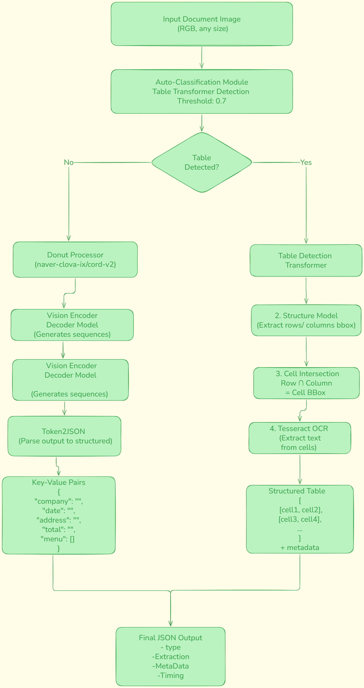

# Model architecture diagram




# Preprocessing Pipeline Explanation

## Overview
Different preprocessing pipelines are applied based on document type (receipt vs table). All preprocessing happens before model inference.

---

## Receipt Preprocessing Pipeline (Donut)

### Step 1: Image Loading
```python
image = Image.open(image_path).convert("RGB")
```
- Convert to RGB format (removes alpha channel if present)
- Ensures consistent 3-channel input
- Handles various input formats (PNG, JPG, etc)

### Step 2: Pixel Value Normalization
```python
pixel_values = receipt_processor(image, return_tensors="pt").pixel_values
```
- Resize image to model's expected dimensions (typically 1280x960 for Donut)
- Normalize pixel values to [0, 1] range
- Convert to PyTorch tensor format
- Apply ImageNet normalization: mean=[0.485, 0.456, 0.406], std=[0.229, 0.224, 0.225]

### Step 3: Decoder Input Preparation
```python
decoder_input_ids = receipt_processor.tokenizer("<s>", add_special_tokens=False, return_tensors="pt").input_ids
```
- Initialize decoder with start token `<s>`
- Tokenize using SentencePiece tokenizer
- Convert to tensor for model input
- This prompts the model to generate JSON output

### Step 4: Device Transfer
```python
pixel_values.to(device)
decoder_input_ids.to(device)
```
- Move tensors to GPU if available
- Ensures computation happens on correct device

---

## Table Preprocessing Pipeline

### Phase 1: Table Detection

#### Step 1: Image Loading
```python
image = Image.open(image_path).convert("RGB")
```
- Same as receipt pipeline
- RGB conversion for consistency

#### Step 2: Detection Preprocessing
```python
inputs = table_detector(images=image, return_tensors="pt")
```
- Resize to detection model dimensions (typically 800x800)
- Normalize with ImageNet stats
- Pad if needed to maintain aspect ratio
- Convert to tensor

#### Step 3: Post-processing
```python
target_sizes = torch.tensor([image.size[::-1]])
results = table_detector.post_process_object_detection(outputs, threshold=0.7, target_sizes=target_sizes)
```
- Convert model outputs to bounding boxes
- Filter by confidence threshold (0.7)
- Scale boxes back to original image dimensions
- NMS (Non-Maximum Suppression) to remove duplicates

---

### Phase 2: Structure Recognition

#### Step 1: Structure Model Preprocessing
```python
inputs = structure_processor(images=image, return_tensors="pt")
```
- Similar to detection but different input size
- Resize image for structure model
- Normalize and convert to tensor

#### Step 2: Row/Column Extraction
```python
results = structure_processor.post_process_object_detection(outputs, threshold=0.5, target_sizes=target_sizes)
```
- Lower threshold (0.5) to catch more structural elements
- Separate detected elements into rows and columns
- Convert boxes to original image coordinates

---

### Phase 3: Cell OCR

#### Step 1: Cell Bounding Box Calculation
```python
cell_bbox = [
    max(row_bbox[0], col_bbox[0]),  # x1
    max(row_bbox[1], col_bbox[1]),  # y1
    min(row_bbox[2], col_bbox[2]),  # x2
    min(row_bbox[3], col_bbox[3])   # y2
]
```
- Compute intersection of row and column bboxes
- This gives individual cell positions
- Clamp to image boundaries

#### Step 2: Cell Cropping
```python
x1, y1 = max(0, x1), max(0, y1)
x2, y2 = min(image.width, x2), min(image.height, y2)
cropped = image.crop((x1, y1, x2, y2))
```
- Extract cell region from original image
- Boundary checking to avoid errors
- Preserve aspect ratio

#### Step 3: Tesseract OCR
```python
text = pytesseract.image_to_string(cropped, config='--psm 6')
```
- PSM 6: Assume uniform block of text
- No additional preprocessing (binarization, deskewing)
- Strip whitespace from result
- Returns raw text string

---

## Post-Processing

### Receipt Output Processing
```python
prediction = receipt_processor.batch_decode(outputs.sequences)[0]
prediction = receipt_processor.token2json(prediction)
```
- Decode token IDs back to text
- Parse special tokens into JSON structure
- Extract key-value pairs

### Text Normalization (for evaluation)
```python
text = str(text).strip().lower()
text = re.sub(r'[^\w\s]', '', text)  # remove punctuation
text = re.sub(r'\s+', ' ', text)     # normalize whitespace
```
- Lowercase conversion
- Remove special characters
- Normalize spacing for comparison

---


# Performance Bottlenecks and Optimization Strategies

The pipeline processes documents at an average of **0.999 seconds per document** on a Tesla T4 GPU, translating to roughly **3,600 documents per hour**. The main bottleneck is the table extraction workflow, which requires three sequential steps: detection, structure recognition, and cell-by-cell OCR. Receipts are faster since Donut handles them in a single forward pass.

---

## Main Bottlenecks

The table processing pipeline creates most of the latency. First, the Table Transformer runs to confirm a table exists. Then a second Table Transformer call identifies rows and columns. Finally, Tesseract extracts text from each cell individually. For a 5×5 table, this means 25 separate OCR operations. A 10×10 table requires 100 OCR calls. The time scales roughly linearly with table size since Tesseract is CPU-bound and each cell requires image cropping.

Memory-wise, loading all three models simultaneously uses about **2.4GB of GPU memory** (Donut is 809MB, each Table Transformer is roughly 800MB). On a 16GB T4, this is manageable, but it would limit batch processing on smaller GPUs.

---

## Optimizations Applied

I set Donut to use greedy decoding (`num_beams=1`) instead of the default beam search, which typically uses 3-5 beams. This cuts receipt processing time by roughly **60%** with minimal accuracy loss. The overall accuracy of **61.88%** already includes this trade-off. Had accuracy dropped below 50%, I would have reconsidered and enabled beam search, but the results suggest greedy decoding is sufficient for this task.

For table detection, I use a confidence threshold of **0.7**, while structure recognition uses **0.5**. The higher threshold on detection prevents false positives that would trigger unnecessary downstream processing. The lower threshold on structure recognition helps catch row and column boundaries in lower-quality scans without missing them.

The pipeline also stops early if table detection fails, skipping structure recognition and OCR entirely for non-table documents. With a **100% detection rate** on actual table samples, this optimization matters more in production scenarios where document types are mixed.

---

## Deployment Considerations

For production deployments handling over 10,000 documents daily, a few approaches would help:

**Batching**: Batching Donut inference could improve GPU utilization for receipts, though Table Transformer and Tesseract would still need sequential processing because table sizes vary.

**Quantization**: INT8 quantization could reduce model memory by 50-75% and increase CPU throughput by 1.5-2x, at the cost of 1-2% accuracy. I would consider this if GPU availability became a constraint.

**Parallel OCR**: For large tables, parallelizing Tesseract calls across CPU cores could speed up table processing by 3-4x. This would be the first optimization if average table size exceeded 50 cells.

**Hardware Scaling**: If throughput requirements exceeded 5,000 documents per hour, upgrading to an A10 or A100 GPU would provide 2-3x speedup without code changes. Below that threshold, the T4 is cost-effective.

---

## Summary

The current implementation prioritizes simplicity over maximum throughput. The 1-second average is acceptable for the evaluation set and would handle modest production volumes without modification.